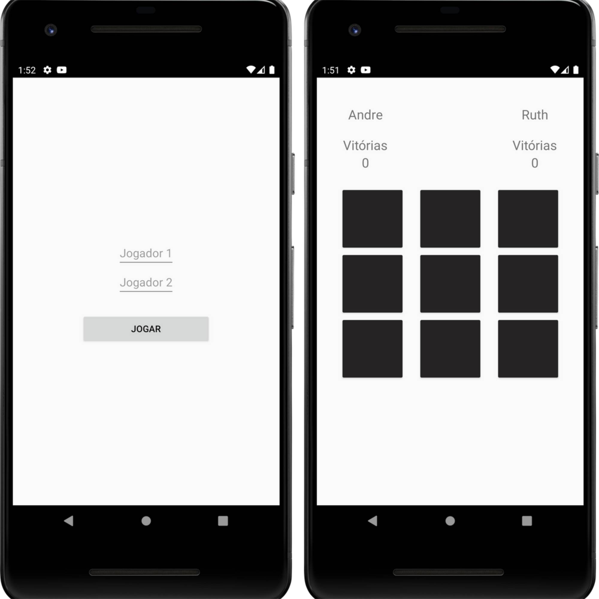

<h1 align="center">Jogo da Velha :video_game:</h1>

<h1 align="center">
  
   
  
</h1>

### Sobre :book:
 Jogo feito para treinar e resolver desafios envolvendo lógica de programação.
 
 ### Funcionalidades

- [x] Dar nome aos jogadores
- [x] Placar 
- [ ] Guardar placar no DATA ROOM
- [ ] Dar nome a apenas um jogador

### Autor

Feito com ❤️ por André Esperança!

Contatos :
 

<a href="www.google.com">
 
  

  <a href="https://github.com/andreesperanca" title="">André Esperança</a>
